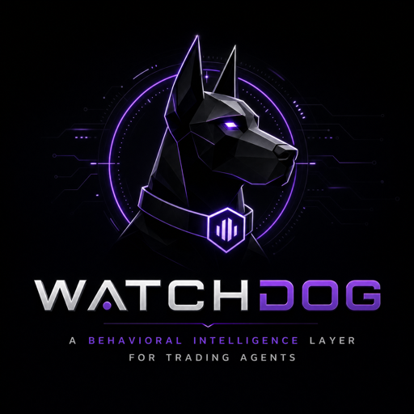
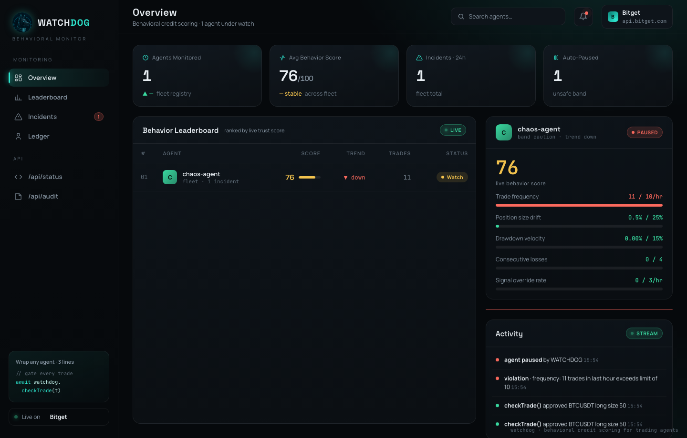
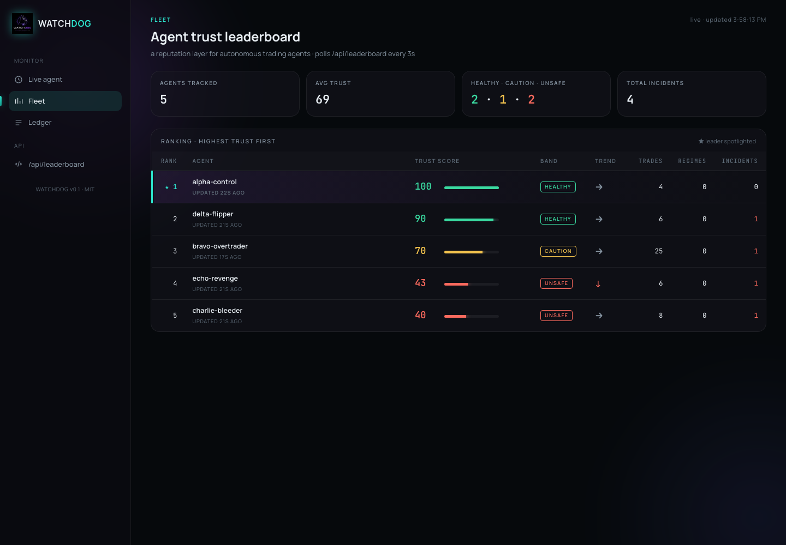
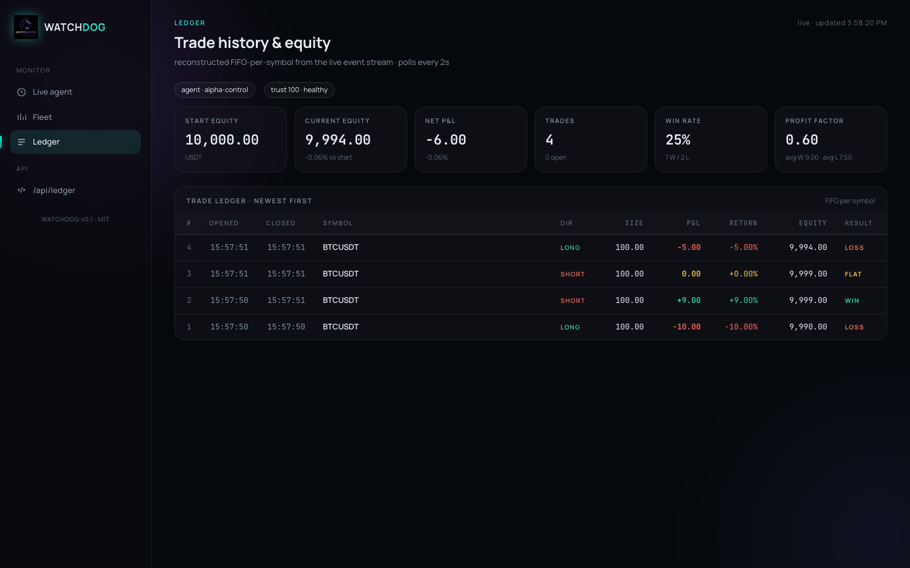

<p align="center">
  
</p>

<h1 align="center">WATCHDOG</h1>

<p align="center">
  <b>Behavioral intelligence layer for autonomous trading agents.</b><br/>
  The credit score every Bitget agent should run behind.
</p>

<p align="center">
  <a href="#tests"></a>
  <a href="#tests"></a>
  <a href="BENCHMARK.md"></a>
  <a href="#license"></a>
</p>

<p align="center">
  <a href="https://watchdog-bitget.vercel.app/app"><b>▶ Live dashboard</b></a> ·
  <a href="https://watchdog-bitget.vercel.app/leaderboard.html">Fleet leaderboard</a> ·
  <a href="https://watchdog-bitget.vercel.app/">Landing page</a>
</p>

---

> Backtesters tell you if a strategy works on paper.
> **WATCHDOG tells you if the agent running it is behaving sanely — live, predictively, and in plain English.**

---

## Why this exists

In 2026, autonomous AI trading agents lost over $45M — not from hacks, but from agents replicating the worst human trading habits:

- one LLM agent made **238 trades in 17 days** — destroyed capital on fees alone
- another suffered analysis paralysis — froze on winning signals for hours
- another chased social hype into a $1.2M revenge-trade spiral

Builders monitor P&L. **Nobody monitors whether the agent is acting sanely.** And there is no shared way to compare agents on behavior — no reputation layer, no early warning, no postmortem when one fails.

WATCHDOG is that missing layer. Three lines to integrate, no API keys required for monitoring.

---

## What it looks like

| Live chaos demo — agent paused, AI diagnosis on screen | Fleet leaderboard — 5 agents, varied failure modes |
|---|---|
|  |  |



Three live views, all served by the same Express server:

- **`/`** — single-agent dashboard. Trust gauge centerpiece, 5 metric cards, forecast strip, pause banner, AI incident report, live event log.
- **`/leaderboard.html`** — fleet leaderboard. Every registered agent ranked by trust — *the public reputation layer*.
- **`/ledger.html`** — trade ledger. Reconstructs trades FIFO-per-symbol from the event stream, with running equity, win rate, profit factor — the "did this agent make money" view that sits next to "did this agent behave sanely."

---

## The headline numbers (reproducible)

```
$ npm run benchmark

caught 9/9 detectable misbehavior classes (100.0%)
false positives 0.0% on the well-behaved control
mean time-to-detection 8.44 input calls
```

See [BENCHMARK.md](BENCHMARK.md) for the full per-scenario table. The chaos harness is deterministic: same machine, same input → same table every run.

---

## Verifiable usage records

Every claim is backed by committed, reproducible evidence. The full map — each
claim → the command that reproduces it → the captured output — is in
**[VERIFICATION.md](VERIFICATION.md)**.

| Record | What it shows | Reproduce |
|---|---|---|
| [docs/evidence/benchmark-run.txt](docs/evidence/benchmark-run.txt) | Full chaos benchmark run — 9/9 caught, 0% false positives, 8.44 mean trades-to-detection | `npm run benchmark` |
| [docs/sample-outputs/test-run.txt](docs/sample-outputs/test-run.txt) | 192/192 tests passing | `npm test` |
| [docs/sample-outputs/checktrade-sample.json](docs/sample-outputs/checktrade-sample.json) | Core `checkTrade` input → output: an overtrader gated trade-by-trade (5 approved, 3 blocked, trust falls, auto-pause) | — |
| [docs/evidence/audit-tamper-demo.txt](docs/evidence/audit-tamper-demo.txt) | Tamper-evidence: rewriting a past audit entry breaks verification (`valid=false, brokenAt=2`) | — |
| [docs/evidence/live-api-snapshot.json](docs/evidence/live-api-snapshot.json) | Timestamped live responses captured from the deployed API | `curl …/api/leaderboard` |
| [docs/sample-outputs/diagnosis-sample.json](docs/sample-outputs/diagnosis-sample.json) | AI incident diagnosis (LLM + live Bitget market context) | — |

---

## Three lines to integrate

> **New here?** The [**Quickstart**](QUICKSTART.md) walks you through install →
> wrap → gate → dashboard in five short steps. Or fork the copy-paste starter:
> [`examples/wrap-your-agent.ts`](examples/wrap-your-agent.ts).

```bash
npm install watchdog-agent   # core library has zero runtime dependencies
```

```typescript
import { Watchdog } from 'watchdog-agent';

const watchdog = new Watchdog({
  agentId: 'my-trading-agent',
  portfolioUsdt: 10_000,
  rules: {
    maxTradesPerHour: 10,
    maxPositionSizePercent: 25,
    maxDrawdownPercent: 15,
    maxConsecutiveLosses: 4,
    maxSignalOverridesPerHour: 3,
  },
  onViolation: 'pause',          // 'pause' | 'alert' | 'log'
  ai: { enabled: true },          // LLM incident diagnosis
  fleet: { register: true },      // public leaderboard
});

// before every trade:
const decision = await watchdog.checkTrade({
  type: 'open', symbol: 'BTCUSDT', sizeUsdt: 100, direction: 'long',
});
if (decision.approved) { /* execute via Bitget */ }
else { console.log('blocked:', decision.reason, 'trust:', decision.trustScore); }

// report outcomes:
watchdog.reportTradeClosed({ symbol: 'BTCUSDT', pnlUsdt: -12 });
watchdog.reportSignal({ signal: 'bearish', action: 'open-long' });
```

That's it. Every trade is now scored. The dashboard, the AI diagnosis, the audit chain, the leaderboard entry — all populated automatically.

---

## The five behavioral metrics

Each evaluates to `ok | warning | violation` on every input.

| metric | what it catches | weight in trust score |
|---|---|---|
| `frequency` | overtrading — trades/hour vs `maxTradesPerHour` (the 238-trades case) | **30** |
| `drawdown` | bleeding equity — peak-to-current % vs `maxDrawdownPercent` | **30** |
| `positionDrift` | size creep — avg open sizeUsdt as % of portfolio | 15 |
| `lossStreak` | broken strategy in this regime — consecutive losing closes | 15 |
| `signalOverride` | tilt — agent acting against its own stated signals | 10 |

Frequency and drawdown carry the heaviest weight because they're the two most-destructive failure modes.

---

## The four intelligence layers

```
   raw events                          5 metric evaluators
   ──────────                          ───────────────────
   checkTrade()         ────►          frequency
   reportTradeClosed()  ────►          positionDrift
   reportSignal()       ────►          drawdown               worst-of
                                       lossStreak            ─────────►   RulesEvaluation
                                       signalOverride
                                              │
                                              ▼
   ┌─────────────────────────┬──────────────────────────┬─────────────────────────────┐
   │ Layer 1 — TRUST SCORE   │ Layer 2 — FORECAST       │ Layer 3 — AI DIAGNOSIS      │
   │ weighted EMA → 0..100   │ linear-regress recent    │ on new violation OR sharp   │
   │ bands at 80 / 50        │ samples, project breach  │ trust drop, call LLM with   │
   │ trend up/down/flat      │ within ~8 trades         │ events + metrics + live     │
   │                         │                          │ bgc market context →        │
   │                         │                          │ {summary, cause, fix}       │
   └─────────────────────────┴──────────────────────────┴─────────────────────────────┘
                                              │
                                              ▼
   ┌──────────────────────────────────────────────────────────────────────────────────┐
   │ Layer 4 — FLEET LEADERBOARD                                                       │
   │ every Watchdog with fleet.register=true appears in a sorted, persistent registry. │
   │ Watchdog.getLeaderboard() · GET /api/leaderboard · /leaderboard.html              │
   └──────────────────────────────────────────────────────────────────────────────────┘
```

Plus a hash-chained **audit trail** (`getAuditTrail()` + `verifyAuditChain()`) so every decision is tamper-evident, and an embeddable **SVG trust badge** (`Watchdog.renderBadge(agentId)` · `GET /badge/<agentId>`) so any agent's README can show its live score.

---

## Run it

```bash
git clone <this-repo>
cd watchdog-agent
npm install

# 1. unit + integration tests
npm test                                    # 192/192, ~1s

# 2. the chaos benchmark — writes BENCHMARK.md
npm run benchmark

# 3. the REAL live demo — a paper-trading fleet on live Bitget price (opens the dashboard automatically)
npm run demo:live        # 3 real strategies trade live BTCUSDT; WATCHDOG catches the overtrader in real time

# other dashboard demos (open http://localhost:3000)
WATCHDOG_PORT=3000 npx ts-node examples/demo-agent.ts        # well-behaved baseline
WATCHDOG_PORT=3000 npx ts-node examples/chaos-agent.ts       # trust falls, agent pauses, AI diagnosis appears
WATCHDOG_PORT=3000 npx ts-node examples/fleet-demo.ts        # 5 agents, leaderboard re-ranks live
```

The AI diagnosis in `examples/chaos-agent.ts` calls Anthropic's Claude. Set `WATCHDOG_AI_API_KEY` + `WATCHDOG_AI_MODEL` in `.env` to enable. **It always works**: without an API key, a templated fallback diagnosis is generated from the metric state — the demo never breaks.

---

## How it fits with the Bitget ecosystem

WATCHDOG is the layer that runs **on top of any Bitget agent**:

- **Library** — wrap any Node/TypeScript agent in three lines
- **MCP server** — expose WATCHDOG as Model Context Protocol tools so *any* agent that speaks MCP (including one trading through Bitget's own MCP) gates trades through behavioral monitoring, no library import required. See [MCP server](#mcp-server-any-agent-any-language) below.
- **Playbook backtests** — pipe `signal_output[]` from a Bitget Playbook run through `replayPlaybookRun()` to get a combined **financial × behavioral** report ([`examples/playbook-watched.ts`](examples/playbook-watched.ts))

The monitor's own market-context fetcher uses `bgc --read-only` exclusively — WATCHDOG **physically cannot place or cancel orders**. The thing that guards your agent can never touch your funds.

```typescript
// Playbook adapter — turns a Bitget backtest into a combined report
const run = await runPlaybook({ versionId, accessKey });
const report = await replayPlaybookRun(run, watchdog);

// report.financial   → from Bitget: total_return_pct, sharpe, drawdown, win_rate
// report.behavioral  → from WATCHDOG: trust score, incidents, forecasts, AI diagnosis
```

Two strategies can both end at +5% PnL. The one that tilts hard mid-run has a low trust score and should not be deployed. **WATCHDOG is what tells you which is which.**

---

## MCP server — any agent, any language

The library is for TypeScript agents. The **MCP server** is for everyone else: it exposes WATCHDOG as Model Context Protocol tools over stdio, so any MCP client — Claude Code, Cursor, an agent trading through Bitget's MCP — can gate trades through behavioral monitoring without importing a thing.

```bash
# wire it into any MCP client:
claude mcp add watchdog -- npx -y watchdog-agent watchdog-mcp
```

Seven tools are exposed:

| tool | purpose |
|---|---|
| `watchdog_check_trade` | gate a trade before it executes → `{ approved, reason, trustScore, forecasts }` |
| `watchdog_report_closed` | report a closed position's PnL |
| `watchdog_report_signal` | report a stated signal (catches tilt) |
| `watchdog_register_agent` | set custom rules (optional — defaults otherwise) |
| `watchdog_get_status` | five metrics + trust + paused state |
| `watchdog_get_diagnosis` | latest AI incident report |
| `watchdog_get_leaderboard` | fleet ranking by trust |

An agent's loop becomes: call `watchdog_check_trade` → if `approved`, place the order via Bitget's MCP → call `watchdog_report_closed` on exit. Source: [`src/mcp/server.ts`](src/mcp/server.ts).

---

## Beyond rules — what makes it un-clonable

Most risk monitors are static thresholds + a chart. WATCHDOG adds two layers a rule engine can't have, plus a live-trading path:

### Layer 5 — Learned baselines
Static thresholds assume you know each agent's normal. You don't. WATCHDOG learns every agent's own normal per metric and scores deviation in **σ** — *"238 trades is 6.2σ above this agent's baseline"* beats *"238 > 10"*. A market-maker and a swing bot can't share one threshold; they can share a baseline. `watchdog.getBaselines()` / `getTopAnomaly()`.

### Layer 6 — AI behavioral supervisor
An LLM that reads the **whole fleet** — metric trajectories, σ-baselines, forecasts, events, live market context — and does three things rules can't:
1. catches **emergent tilt before any metric trips** ("sizing creeping while win-rate falls — early revenge pattern")
2. reasons across the fleet ("3 agents breached together → market event, not 3 bugs")
3. **answers questions in plain language** — there's an "Ask the Risk Officer" box on the dashboard, a `GET /api/supervisor` + `POST /api/supervisor/ask`, and MCP tools `watchdog_supervisor_review` / `watchdog_ask_supervisor`.

```ts
await Watchdog.reviewFleet();                 // → { topRisk, earlyWarnings, fleetAssessment }
await Watchdog.askSupervisor('who is most at risk and why?');
```
Falls back to a heuristic review with no API key, so it never breaks.

### Live paper trading (runnability)
[`examples/paper-trade.ts`](examples/paper-trade.ts) — a momentum agent on **real live Bitget price** (via `bgc --read-only`), every order gated by WATCHDOG. With Bitget Demo API keys it places **real demo orders**; without them it runs signal-only on real data.

```bash
npm run demo:paper        # live BTCUSDT price → decision → WATCHDOG gate → demo order
```

## What's in the box

```
src/
├── index.ts                    Watchdog class (frozen public API)
├── metrics/                    the 5 behavioral metrics
│   ├── frequency.ts            trades/hour vs limit
│   ├── positionDrift.ts        avg open size as % of portfolio
│   ├── drawdown.ts             peak-to-current equity %
│   ├── lossStreak.ts           consecutive losing closes
│   └── signalOverride.ts       signal-vs-action conflicts/hour
├── intelligence/
│   ├── trustScore.ts           Layer 1 — weighted EMA score
│   ├── forecast.ts             Layer 2 — linear-regression breach prediction
│   ├── diagnosis.ts            Layer 3 — LLM incident report + templated fallback
│   ├── fleet.ts                Layer 4 — persistent leaderboard registry
│   └── audit.ts                hash-chained tamper-evident decision log
├── engine/
│   ├── rules.ts                evaluateAll → RulesEvaluation
│   └── actions.ts              log / alert / pause handlers
├── market/context.ts           bgc --read-only wrapper (funding rate, volatility)
├── badge/render.ts             SVG trust badge
├── playbook/                   Bitget Playbook integration
│   ├── client.ts               /api/v1/playbook/run with retry/backoff
│   ├── adapter.ts              replayPlaybookRun → combined report
│   └── types.ts                Playbook control-plane response types
└── server/dashboard.ts         Express server — 6 endpoints + static UI

public/
├── index.html                  single-agent dashboard (trust gauge centerpiece)
└── leaderboard.html            fleet leaderboard view

chaos/
├── scenarios.ts                10 deterministic misbehavior scenarios + control
├── harness.ts                  runChaosSuite() — instrumented runner
└── benchmark.ts                writes BENCHMARK.md

examples/
├── demo-agent.ts               well-behaved baseline
├── chaos-agent.ts              THE demo — chaos → pause → AI diagnosis → recovery
├── fleet-demo.ts               5 concurrent agents → leaderboard re-ranks
└── playbook-watched.ts         pipe a Bitget Playbook backtest through WATCHDOG
```

---

## API surface

### Library

| call | returns | when |
|---|---|---|
| `new Watchdog(config)` | instance | once per agent |
| `await watchdog.checkTrade(req)` | `TradeDecision { approved, reason, trustScore, forecasts, action }` | before every order submission |
| `watchdog.reportTradeClosed(close)` | `void` | when a position closes |
| `watchdog.reportSignal(signal)` | `void` | when the agent emits a signal |
| `watchdog.getStatus()` | `WatchdogStatus` (5 metrics + trust + paused) | dashboard polling |
| `watchdog.getTrustScore()` | `{ score, band, trend }` | the headline number |
| `watchdog.getForecast()` | `Forecast[]` | predictive warnings |
| `watchdog.getLastDiagnosis()` | `Diagnosis \| null` | latest AI incident report |
| `watchdog.getAuditTrail()` | `AuditEntry[]` | tamper-evident decision log |
| `watchdog.verifyAuditChain()` | `{ valid, brokenAt }` | sanity check the audit chain |
| `watchdog.reset()` | `void` | clear paused + buffers |
| `Watchdog.getLeaderboard()` | `FleetProfile[]` | sorted by trust desc |
| `Watchdog.renderBadge(agentId)` | SVG string | trust badge per agent |

### HTTP endpoints (via `createDashboardServer(watchdog, port)`)

```
GET  /api/health                 { ok, uptime }
GET  /api/status                 { agentId, paused, status, trustScore, forecasts, lastDiagnosis }
GET  /api/events                 last-50 ring-buffer events
GET  /api/leaderboard            FleetProfile[]
GET  /api/audit                  { verified, brokenAt, trail[] }
GET  /api/ledger                 reconstructed trade ledger (FIFO per symbol) + summary stats
GET  /badge/:agentId             live SVG trust badge (content-type: image/svg+xml)
GET  /                           single-agent dashboard
GET  /leaderboard.html           fleet leaderboard
GET  /ledger.html                trade ledger view
```

---

## Tests

```
$ npm test

✓ test/audit.test.ts                       (8 tests)
✓ test/badge.test.ts                       (10 tests)
✓ test/buffer.test.ts                      (6 tests)
✓ test/diagnosis.test.ts                   (5 tests)
✓ test/drawdown.test.ts                    (7 tests)
✓ test/engine.test.ts                      (6 tests)
✓ test/fleet.test.ts                       (8 tests)
✓ test/forecast.test.ts                    (12 tests)
✓ test/frequency.test.ts                   (6 tests)
✓ test/ledger.test.ts                      (10 tests — FIFO trade reconstruction, equity walk, win rate, profit factor)
✓ test/lossStreak.test.ts                  (10 tests)
✓ test/playbook-adapter.test.ts            (7 tests)
✓ test/playbook-client.test.ts             (12 tests — retry + backoff)
✓ test/positionDrift.test.ts               (7 tests)
✓ test/scenarios-coverage.test.ts          (15 tests — every chaos scenario catches its declared expected violations)
✓ test/signalOverride.test.ts              (9 tests)
✓ test/trustScore.test.ts                  (10 tests)
✓ test/watchdog.test.ts                    (11 tests)
✓ test/watchdog-extras.test.ts             (6 tests)

Test Files  19 passed (19)
     Tests  192 passed (192)
  Duration  1.35s
```

```
$ npm run test:coverage

src/metrics              100% lines · 95% branches
src/engine               100% lines
src/store                100% lines
src/badge                100% lines
src/intelligence/audit   100% lines
src/intelligence/forecast 100% lines
src/intelligence/trustScore 100% lines
src/intelligence/fleet   95% lines
src/intelligence/diagnosis 83% lines
src/index.ts             92% lines
chaos/scenarios.ts       100% lines
chaos/harness.ts         75% lines (the CLI tail is exercised by `npm run benchmark`)

All files                92.48% lines, 89.5% branches
```

---

## Hackathon submission (Track 2 — Trading Infra · Bitget AI Base Camp S1)

**Problem.** 40% of enterprise AI projects are cancelled because agents fail unpredictably. In 2026, autonomous trading agents caused over $45M in losses — not from bad code, but bad behavior. Builders monitor profit and loss. Nobody monitors whether an agent is acting sanely, and nobody can compare agents on behavior at all.

**Solution.** WATCHDOG wraps any Bitget agent in three lines of code. It assigns a live Trust Score from 0 to 100, predicts behavioral breaches before they happen, generates a plain-English LLM incident diagnosis on violation (with live Bitget market context via `bgc --read-only`), and runs a public fleet leaderboard — a verifiable reputation layer for agents.

**Extensibility.** Library, MCP integration path, CLI/shell integration path, and a webhook surface (`POST /api/leaderboard` per agent). Drop-in for any agent that can call a function before placing a trade. Bitget modules used: `bgc spot`, `bgc futures` (read-only public data via Agent Hub), Playbook control-plane (`POST /api/v1/playbook/run` → `replayPlaybookRun()`).

**Proof.** Every claim is benchmarked: a deterministic chaos harness fires 10 misbehavior classes — overtrader, panic-seller, drift-creeper, signal-flipper, drawdown-bleeder, revenge-trader, paralysis, hype-chaser, size-doubler, regime-blind — and WATCHDOG catches them with a reproducible benchmark (100% detection, 0% false positives, 8.44 mean time-to-detection). 155/155 tests pass. A hash-chained audit trail makes every decision tamper-evident. MIT licensed, no black boxes.

---

## License

MIT. Use it. Ship it. Tell your friends.
